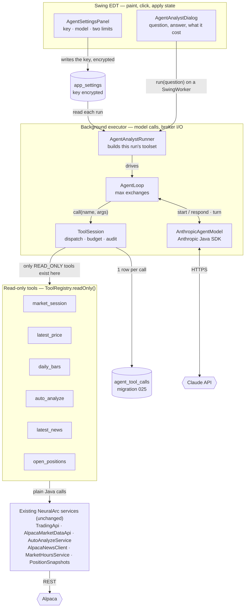
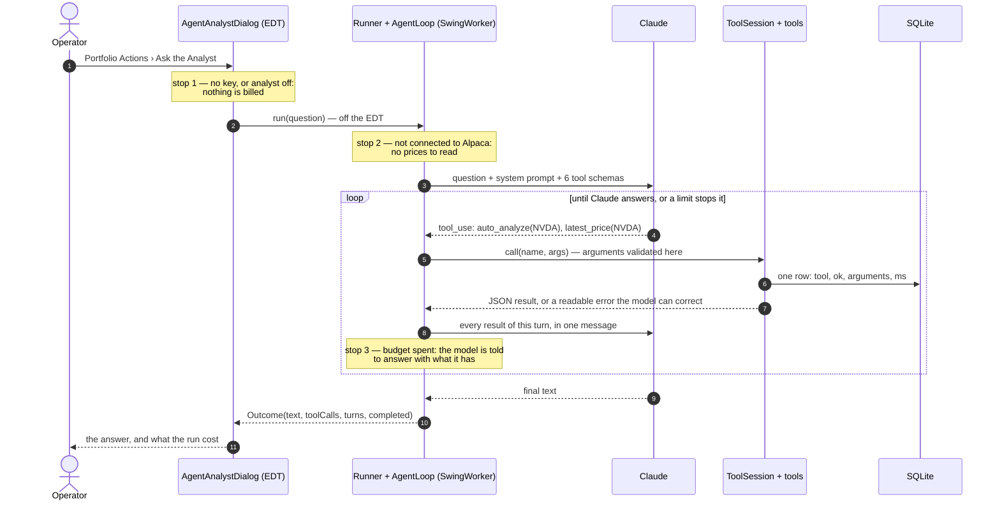
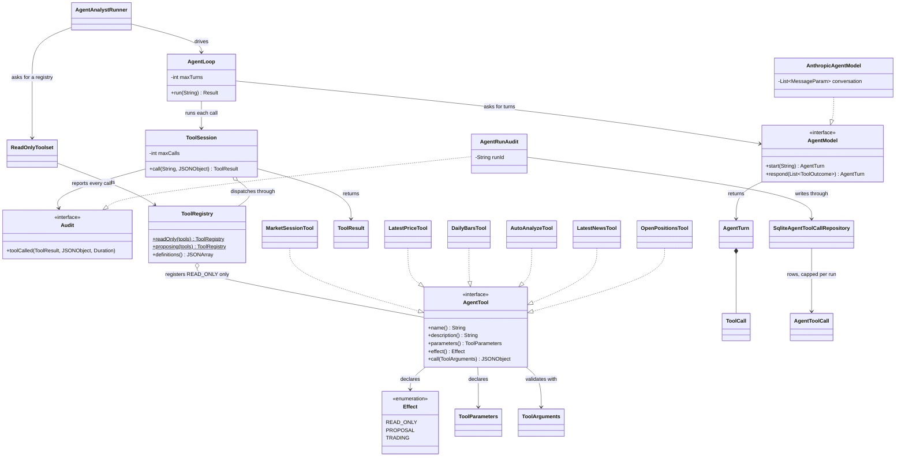

# The read-only analyst agent (`com.neuralarc.agent`)

Status: **implemented, not yet exercised against the live API.**
Scope: the AI analyst wired into Portfolio Actions, its tools, its audit trail and its settings.

The agent is a *consumer* of NeuralArc, not a new path into it. Every tool wraps a service the
app already had, so an agent read and an operator read return the same numbers, and the model
never holds a broker client. It can only read: `ToolRegistry.readOnly()` refuses, at construction,
any tool whose `Effect` is above `READ_ONLY`, so granting write access is a deliberate edit to
`ReadOnlyToolset` rather than something a prompt can talk its way into.

Follows the rules in `AGENTS.md`: nothing here runs on the EDT, the API key is stored encrypted,
and the audit table arrived through an append-only migration (`025_agent_tool_calls`).

---

## 1. Architecture

Everything below the EDT boundary runs on a `SwingWorker`; everything below the read-only
barrier can only read.

`open_positions` deliberately reads the UI's cached book through `PositionSnapshots`, never the
broker: asking a question must not set off a broker sweep.

---

## 2. One run, end to end

Three guards stop a run early, and each of them costs nothing.

Two details the drawing is there to make explicit:

- **All of a turn's tool results go back in one message.** Splitting them across messages trains
  the model out of asking for tools in parallel.
- **A failed call still spends budget.** That is what makes a retry loop terminate.

Limits are counted in `AgentLoop` (exchanges) and `ToolSession` (tool calls), never in the
prompt — a model can talk itself out of an instruction, not out of a counter.

---

## 3. Class interaction

Two interfaces carry the design:

- **`AgentModel`** keeps the loop testable with no key and no network, and lets a second provider
  drop in without touching the loop.
- **`ToolSession.Audit`** keeps persistence out of the loop: nothing in `agent/` except
  `AgentRunAudit` knows SQLite exists.

**The edge that is not in the diagram is the point.** No class here reaches `StrategyService`,
`TradingApi.placeBuyOrder`, or any repository that writes a strategy.

---

## 4. Files

| Area | Classes |
| --- | --- |
| Agent core | `agent/AgentLoop`, `AgentModel`, `AgentTurn`, `ToolSession`, `ToolRegistry`, `ToolResult`, `AgentTool`, `ToolParameters`, `ToolArguments`, `ReadOnlyToolset` |
| Provider | `agent/AnthropicAgentModel` (Anthropic Java SDK, `claude-opus-5` by default) |
| Tools | `agent/tools/` — `MarketSessionTool`, `LatestPriceTool`, `DailyBarsTool`, `AutoAnalyzeTool`, `LatestNewsTool`, `OpenPositionsTool`, `PositionSnapshots` |
| Audit | `agent/AgentRunAudit`, `db/SqliteAgentToolCallRepository`, `model/AgentToolCall`, `AppDatabase` migration `025_agent_tool_calls` |
| UI | `ui/AgentAnalystDialog`, `ui/AgentAnalystRunner`, `ui/AgentSettingsPanel`, entry point in `PortfolioActionsMenuBuilder` |
| Settings | `model/AgentSettings`, `AppSettingsService.loadAgentSettings()` / `saveAgentSettings()` (key stored encrypted) |

## 5. Extending it

Adding a tool that only reads: implement `AgentTool` with `Effect.READ_ONLY`, register it in
`ReadOnlyToolset.create(...)`, and write the description as prompt text — it is what the model
reads to decide whether to call it.

Adding a tool that *writes* is a deliberate step down a different path: give it
`Effect.PROPOSAL`, build the registry with `ToolRegistry.proposing(...)`, and have it write a
strategy with status `CREATED` into its own workspace for a human to review and activate. Nothing
should ever carry `Effect.TRADING` without the operator asking for it explicitly.
